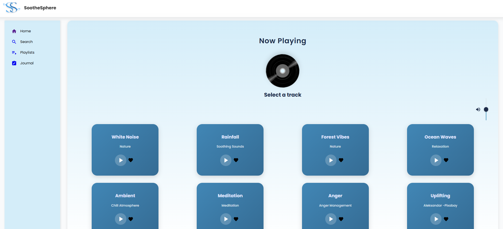
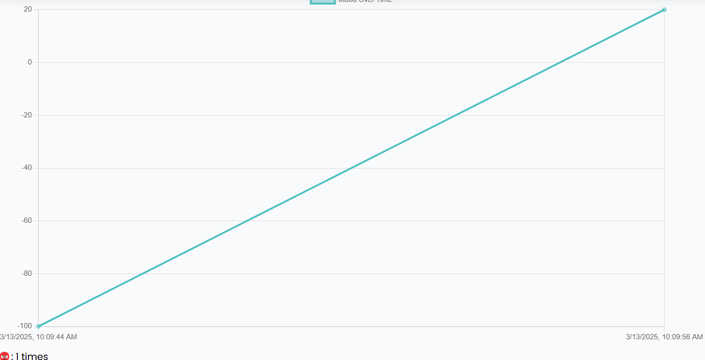
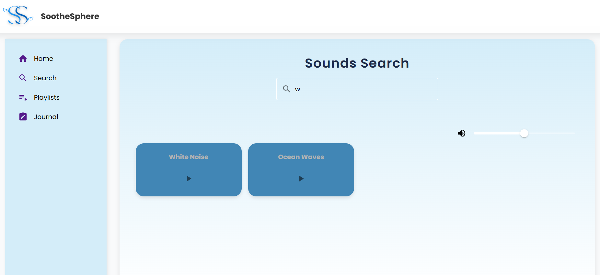
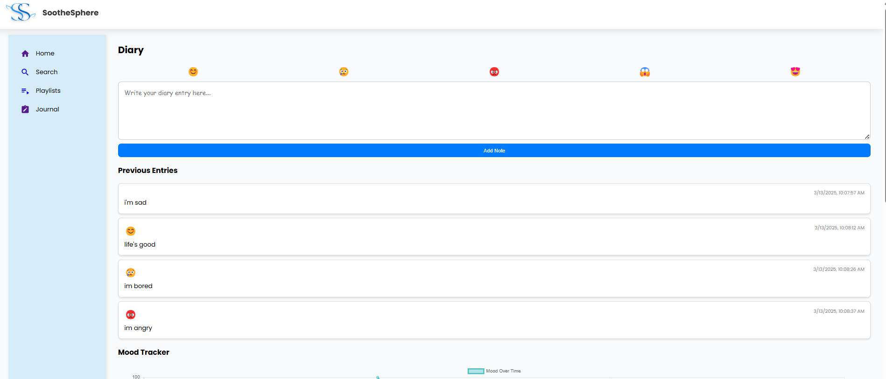

# SootheSphere

## 🌿 Overview
SootheSphere is a personalized sound therapy application that helps users relax and improve focus using binaural beats, isochronic tones, and nature sounds. Developed as part of the **WLiT Hackathon**, this project offers a seamless and immersive sound experience tailored to individual preferences.

## 🚀 Features
- 🎵 **Personalized Sound Therapy** - Generate binaural beats and isochronic tones based on user preferences.
- ✨ **Favorite Sound Library** - Save and access your favorite sounds for a customized experience.
- 📚 **Mood Diary** - Log daily moods using emoticons and associate sounds with them.
- 📊 **Mood Tracker Graph** - Visualize mood patterns over time.
- 🔍 **Search & Discover** - Easily find sounds that match your mood.
- 🌐 **Modern UI** - Beautiful, accessible, and responsive design.

## 🛠 Tech Stack
### Frontend
- **React.js** - UI components
- **Material-UI** - Styled components

### Backend
- **Node.js & Express.js** - API and server logic
- **MongoDB** - Database for storing user data


## 🔧 Setup & Installation
1. **Clone the repository:**
   ```sh
   git clone https://github.com/Praju2002/WLiT-Hackathon.git
   cd WLiT-Hackathon
   ```
2. **Install dependencies:**
   ```sh
   cd server
   npm install
   cd ../client
   npm install
   ```
3. **Start the development servers:**
   - Backend:
     ```sh
     cd server
     nodemon server.js
     ```
   - Frontend:
     ```sh
     cd client
     npm run dev
     ```

## 📌 Contribution Guidelines
We welcome contributions! To contribute:
1. Fork the repository.
2. Create a new branch (`feature-branch`)
3. Commit your changes (`git commit -m 'Add new feature'`)
4. Push to the branch (`git push origin feature-branch`)
5. Open a pull request








## 📞 Contact
For any questions or feedback, feel free to reach out!
- Email: prajukhanal21@gmail.com
- GitHub: [Praju2002](https://github.com/Praju2002)

